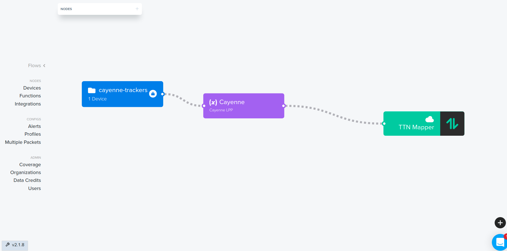

# Helium integration

A HTTP Integration allows you to upload data to CoverageMap.net (aka TTN Mapper)

The goal of CoverageMap.net is to provide a map of the actual coverage of Helium Hotspots. Contributors to CoverageMap.net measure the performance of Hotspots in their vicinity and upload this information to the CoverageMap.net website. Here the information is aggregated and shared with the community.

Go to [CoverageMap.net](https://coveragemap.net) for the global coverage map.

## Prerequisites

1. GPS tracker device
2. (optional) label to group mapping devices
3. Payload decoder
4. Integration
5. Configure Multiple Packets
6. Set up flow

If you are already sending mapping data to https://mappers.helium.com/, you can skip to step nr 4 where we configure the CoverageMap.net integration. CoverageMap.net supports the same decoded payload format as https://mappers.helium.com/.

### 1. GPS tracker device

In order to contribute to CoverageMap.net, a LoRaWAN device with a GPS, capable of transmitting its GPS coordinates, is required. The minimal location information that needs to be sent by the device is its latitude and longitude. Preferably it should also send its altitude and HDOP values.

Regsiter your device on the Helium Console under `Nodes` -> `Devices`.

### 2. Label mapping devices

It is useful to label your mapping devices. On the console under the devices page, there is a folder icon with a plus at the top. Click on it to create a label. Then go to All Devices, select your device, then click `+ Add label` and choose the label you just created.

### 3. Payload decoder

On the console go to `Nodes` -> `Functions`. Create a new function `(+)`. Function type Decoder. If your device transmits using the Cayenne LPP format, choose that. Otherwise choose custom script and provide a valid decoder for your device. Make sure your decoder provides at least the Latitude and Longitude fields.

Some standard payload decoders can be found on [Helium's GitHub](https://github.com/helium/console-decoders)

### 4. Integration

On the console go to `Nodes` -> `Integrations`. Add a new integration. Choose `HTTP` under custom.

End point details:
* POST
* Endpoint URL: `https://integrations.ttnmapper.org/helium/v1`
* HTTP Headers: Key = `TTNMAPPERORG-USER`, Value = your email address
* Name: CoverageMap.net (or any other name you prefer)
* Add integration
* Do not change the JSON message template. If you do, delete the integration and create it again.

### 5. Configure Multiple Packets

On the console go the `Node` -> `Multiple Packets`. Add multiple packet config. 
* Multiple packet name: `All Available Packets`
* How many to purchase: `All Available Packets` (move all the way to the right)
* Create Multiple Packet Config

### 6. Set up flow

On the console go to `Flows`.

At the top left hand side click on Nodes, Labels, and drag the mapping nodes label you created in step 2 to the open space below. 

Then choose functions and drag the decoder you created in step 3 to the open space. 

Lastly, click on integrations and drag the CoverageMap.net integration to the open space.

You should now have three blocks side by side in the window.

Click on the device label. In the settings panel that opens on the right, click on the `Packets` tab. You should see the `All Available Packets` config you created in step 5. Enable it. Close the pane.

Connect the label node to the decoder node, and then connect the decoder node to the integrations node. Like in the picture below.

## Verify the integration is working correctly

In order to verify whether the integration has been configured correctly, go to your device on the Console. Switch on your device and make sure you see data appearing under real time packets. Now go to the ttnmapper.org website and in the menu select "[Advanced maps](https://ttnmapper.org/advanced-maps/)". In the "Device data" section enter your Device Name in the Device ID field. In the Start Date and End Date fields choose today. Click on "View map" and you should see the data points sent by your end device.

## Experiments

### When should I use an "experiment" to map my coverage?

An experiment is a way to keep unrealistic coverage measurements away from the main map. Experiments should be used when testing new hardware or coverage is mapped from aeroplanes, balloons or any similar unrealistic altitudes.

In other words logging to the main map should only be done from roughly 0.5m-2m above ground level. "Ground level" should be interpreted as any place easily accessible by a human - or any place where an IoT device would commonly be installed. The top of a skyscraper is only acceptable if the skyscraper has a viewing deck that is publicly accessible. Man made hills and natural mountains are acceptable. The roof of a car or small delivery truck is fine. The roof of a bus or 14 wheeler truck is not as that is not a average acceptable height at which a sensor will be installed. The dashboard of a truck or bus is however roughly 2m above ground and therefore acceptable.

### Enable or disable logging to an experiment

* To log to an experiment, we need to add a header to the HTTP integration which will tell CoverageMap.net to log the data to an experiment, with Key = **TTNMAPPERORG-EXPERIMENT**. You only need to provide an experiment name if you are testing and do not want your mapping results to contribute to the main coverage map for the network. In other words, when you are mapping normally with a device that is between 1 and 2 meter above ground level, you can leave this field blank. If you are doing anything else like launching and tracking a balloon, please provide a unique experiment name here. Adding the date to the experiment name helps to find it again later. Also see [Experiments](#experiments).
* To stop logging to an experiment, delete the `TTNMAPPERORG-EXPERIMENT` header entry.
